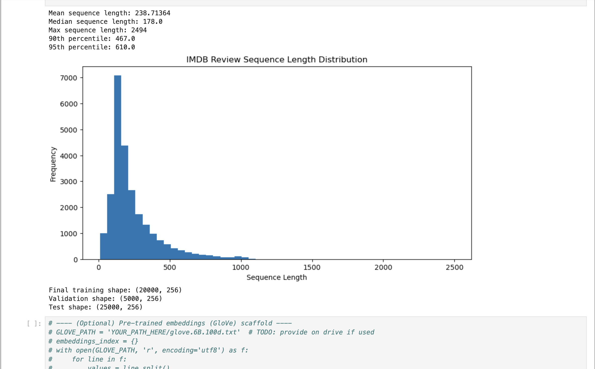
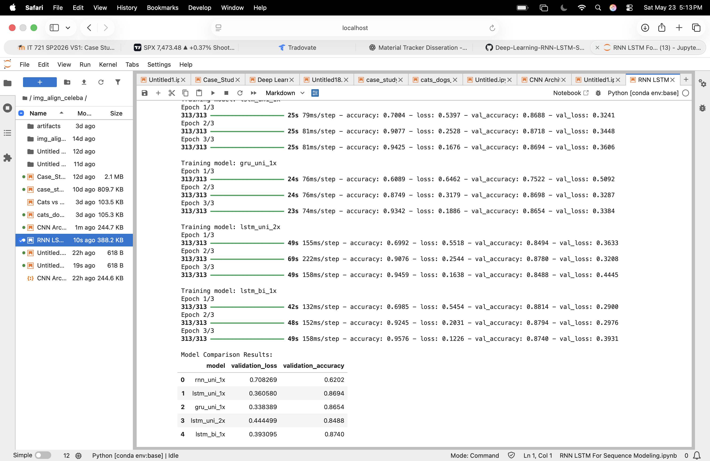

# Deep-Learning-RNN-LSTM-Sequence-Modeling
Deep learning sequence modeling system using RNN and LSTM architectures for temporal prediction, sequential learning, and advanced neural network analysis.
---
## Visualizations

### Sequence Length Distribution

Illustrates IMDB review length analysis used to determine sequence truncation and padding strategy.



### Model Comparison Results

Comparison of RNN, LSTM, GRU, stacked LSTM, and bidirectional LSTM architectures using validation accuracy and loss metrics.


---
## Final Model Performance

Best Performing Model: **LSTM_BI_1X (Bidirectional LSTM)**

- Validation Accuracy: 87.40%
- Validation Loss: 0.3931
- Dataset: IMDB Reviews
- Sequence Length: 256
---
## Repository Structure

```text
Deep-Learning-RNN-LSTM-Sequence-Modeling/
│
├── notebooks/
│   └── RNN LSTM For Sequence Modeling.ipynb
│
├── visuals/
│   ├── sequence_length_distribution.png
│   └── model_comparison_results.png
│
├── data/
├── README.md
└── requirements.txt
```
--
## Installation & Execution

Clone repository:

```bash
git clone https://github.com/Dare215/Deep-Learning-RNN-LSTM-Sequence-Modeling.git
```

Install dependencies:

```bash
pip install -r requirements.txt
```

Run notebook:

```bash
jupyter notebook
```
---
